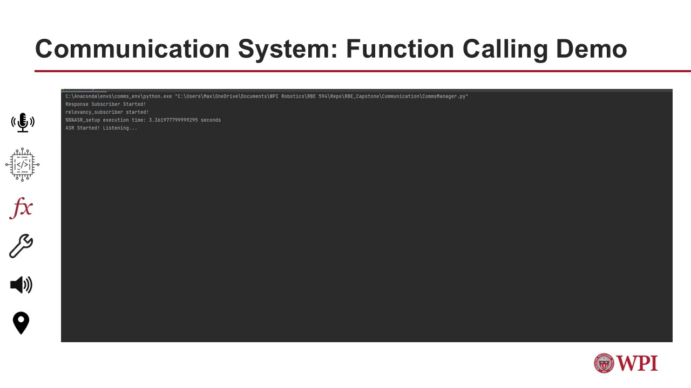

# Communication System Stack

[Full slides](https://github.com/mweissman2/Intuitively-Controlled-Autonomous-System-to-Aid-the-Visually-Impaired/blob/Audio_Handling/Assets/comms_slides.pdf)

## Communication System Input Design

## Communication System Output Design

# Demonstrations
## Function Calling

<video src="https://github.com/mweissman2/Intuitively-Controlled-Autonomous-System-to-Aid-the-Visually-Impaired/blob/Audio_Handling/Assets/Videos/function_calling_demo.mp4" width="300" />

