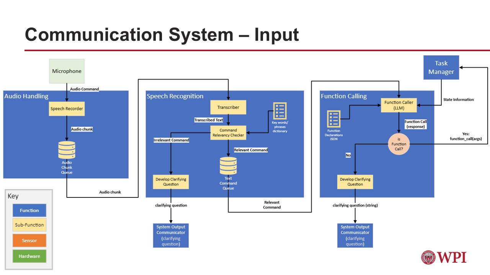

# Communication System Stack

[Full slides](https://github.com/mweissman2/Intuitively-Controlled-Autonomous-System-to-Aid-the-Visually-Impaired/blob/Audio_Handling/Assets/comms_slides.pdf)

## Communication System Input Design

## Communication System Output Design

# Demonstrations
## Function Calling

https://github.com/user-attachments/assets/6078a93b-11a0-43d5-8306-f31207dfe82e

## Global Navigation

https://github.com/user-attachments/assets/5462722f-26c4-4210-b6ff-145f6a550437

## Scene Description

https://github.com/user-attachments/assets/855ebbcf-f066-49f4-8a58-8796cdecfc11
